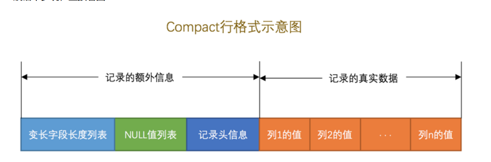

# 《MySQL是怎样运行的》__读书笔记

## 第一章：重新认识MySQL

* MySQL支持的三种通讯方式：

  1. TCP/IP:

     3306

  2. 命名管道和共享内存：

     需要在同一台主机中，Windows系统

     * 命名管道：

       需要在启动服务器程序的命令中加上 --enable-named-pipe 参数，然后在启动客户端程序的命令中加入 -- pipe 或者 --protocol=pipe 参数。

     * 共享内存：

       需要在启动服务器程序的命令中加上 --shared-memory 参数，在成功启动服务器后， 共享内存 便成为本地 客户端程序的默认连接方式，不过我们也可以在启动客户端程序的命令中加入 --protocol=memory 参数来显 式的指定使用共享内存进行通信。

  3. Unix域套接字文件：

     ```
     如果我们的服务器进程和客户端进程都运行在同一台操作系统为类 Unix 的机器上的话，我们可以使用 Unix域套
     接字文件 来进行进程间通信。如果我们在启动客户端程序的时候指定的主机名为 localhost ，或者指定了 --
     protocol=socket 的启动参数，那服务器程序和客户端程序之间就可以通过 Unix 域套接字文件来进行通信了。
     MySQL 服务器程序默认监听的 Unix 域套接字文件路径为 /tmp/mysql.sock ，客户端程序也默认连接到这个
     Unix 域套接字文件。如果我们想改变这个默认路径，可以在启动服务器程序时指定 socket 参数，就像这样：
     mysqld --socket=/tmp/a.txt
     这样服务器启动后便会监听 /tmp/a.txt 。在服务器改变了默认的 UNIX 域套接字文件后，如果客户端程序想通
     过 UNIX 域套接字文件进行通信的话，也需要显式的指定连接到的 UNIX 域套接字文件路径，就像这样：
     mysql -hlocalhost -uroot --socket=/tmp/a.txt -p
     这样该客户端进程和服务器进程就可以通过路径为 /tmp/a.txt 的 Unix 域套接字文件进行通信了。
     
     ```


* 一个请求的流程：

  1. 连接管理：

     多线程 --> 线程池

     SSL安全层

  2. 解析与优化：

     1. 查询缓存：

        * 相同请求可以直接从缓存中查询结果
        * 任何字符上的不同都会导致不能命中
        * 如果涉及到的表中结构或者数据被修改，也不能使用缓存

     2. 语法解析：

        本质上是编译过程，涉及到词法解析、语法、语义分析

        将要查询的表、各种查询条件都提取出来放到MySQL服务器内部使用的数据结构中去

     3. 查询优化

        为提升效率，将查询语句优化：

        生成一个更高效率的查询计划

  3. 存储引擎：

     封装了数据的存储和提取操作

     ```
     我们知道 表 是由一行一行的记录组成的，但这只是一个逻辑上的概
     念，物理上如何表示记录，怎么从表中读取数据，怎么把数据写入具体的物理存储器上，这都是 存储引擎 负责
     的事情。为了实现不同的功能， MySQL 提供了各式各样的 存储引擎 ，不同 存储引擎 管理的表具体的存储结构
     可能不同，采用的存取算法也可能不同。
     ```

     

##  第2章 MySQL的调控按钮-启动选项和系统变量

**暂略部分**


##  第4章 从一条记录说起-InnoDB记录结构

* 真实数据在不同存储引擎中存放的格式一般是不同的

* InnoDB页简介

  ```
  InnoDB 采取的方式是：将数据划分为若干个页，以页作为磁盘和内存之间交互的基本单位，InnoDB中页的大小
  一般为 16 KB。也就是在一般情况下，一次最少从磁盘中读取16KB的内容到内存中，一次最少把内存中的16KB
  内容刷新到磁盘中。
  ```

* InnoDB行格式：

  ```
  设计 InnoDB 存储引擎的大叔们到现在为止设计了4种不同类型的 行格式 ，分别是 Compact 、 Redundant 、
  Dynamic 和 Compressed 行格式，随着时间的推移，他们可能会设计出更多的行格式，但是不管怎么变，在原理
  上大体都是相同的。
  ```

  * Compact

    

  ```
  这部分信息是服务器为了描述这条记录而不得不额外添加的一些信息，这些额外信息分为3类，分别是 变长字段
  长度列表 、 NULL值列表 和 记录头信息
  ```

  ```
  我们知道 MySQL 支持一些变长的数据类型，比如 VARCHAR(M) 、 VARBINARY(M) 、各种 TEXT 类型，各种 BLOB 类
  型，我们也可以把拥有这些数据类型的列称为 变长字段 ，变长字段中存储多少字节的数据是不固定的，所以我
  们在存储真实数据的时候需要顺便把这些数据占用的字节数也存起来，这样才不至于把 MySQL 服务器搞懵，所以
  这些变长字段占用的存储空间分为两部分：
  1. 真正的数据内容
  2. 占用的字节数
  在 Compact 行格式中，把所有变长字段的真实数据占用的字节长度都存放在记录的开头部位，从而形成一个变长
  字段长度列表，各变长字段数据占用的字节数按照列的顺序逆序存放，我们再次强调一遍，是逆序存放！
  变长字段长度列表中只存储值为 非NULL 的列内容占用的长度，值为 NULL 的列的长度
  是不储存的 。
  ```

  ```
  我们知道表中的某些列可能存储 NULL 值，如果把这些 NULL 值都放到 记录的真实数据 中存储会很占地方，所
  以 Compact 行格式把这些值为 NULL 的列统一管理起来，存储到 NULL 值列表中，它的处理过程是这样的：
  1. 首先统计表中允许存储 NULL 的列有哪些。
  2. 如果表中没有允许存储 NULL 的列，则 NULL值列表 也不存在了，否则将每个允许存储 NULL 的列对应一个
  二进制位，二进制位按照列的顺序逆序排列，
  3. MySQL 规定 NULL值列表 必须用整数个字节的位表示，如果使用的二进制位个数不是整数个字节，则在字节
  的高位补 0
  ```

* 记录的真实数据

  ```
  对于 record_format_demo 表来说， 记录的真实数据 除了 c1 、 c2 、 c3 、 c4 这几个我们自己定义的列的数据
  以外， MySQL 会为每个记录默认的添加一些列（也称为 隐藏列 ），具体的列如下：
  DB_ROW_ID、DB_TRX_ID、DB_ROLL_PTR，我们为了美观才写成了row
  _id、transaction_id和roll_pointer。
  
  
  这里需要提一下 InnoDB 表对主键的生成策略：优先使用用户自定义主键作为主键，如果用户没有定义主键，则
  选取一个 Unique 键作为主键，如果表中连 Unique 键都没有定义的话，则 InnoDB 会为表默认添加一个名为
  row_id 的隐藏列作为主键。所以我们从上表中可以看出：InnoDB存储引擎会为每条记录都添加 transaction_id
  和 roll_pointer 这两个列，但是 row_id 是可选的（在没有自定义主键以及Unique键的情况下才会添加该列）。
  这些隐藏列的值不用我们操心， InnoDB 存储引擎会自己帮我们生成的。
  
  ```


## 第五章 盛放记录的大盒子-InnoBD数据页结构

* 在一个数据页中查找指定主键值的记录过程分为两步：

  ```
  1. 通过二分法确定该记录所在的槽，并找到该槽中主键值最小的那条记录。
  2. 通过记录的 next_record 属性遍历该槽所在的组中的各个记录
  ```

* 总结：

  ```
  1. InnoDB为了不同的目的而设计了不同类型的页，我们把用于存放记录的页叫做 数据页 。
  2. 一个数据页可以被大致划分为7个部分，分别是
  File Header ，表示页的一些通用信息，占固定的38字节。
  Page Header ，表示数据页专有的一些信息，占固定的56个字节。
  Infimum + Supremum ，两个虚拟的伪记录，分别表示页中的最小和最大记录，占固定的 26 个字节。
  User Records ：真实存储我们插入的记录的部分，大小不固定。
  Free Space ：页中尚未使用的部分，大小不确定。Page Directory ：页中的某些记录相对位置，也就是各个槽在页面中的地址偏移量，大小不固定，插
  入的记录越多，这个部分占用的空间越多。
  File Trailer ：用于检验页是否完整的部分，占用固定的8个字节。
  3. 每个记录的头信息中都有一个 next_record 属性，从而使页中的所有记录串联成一个 单链表 。
  4. InnoDB 会为把页中的记录划分为若干个组，每个组的最后一个记录的地址偏移量作为一个 槽 ，存放在
  Page Directory 中，所以在一个页中根据主键查找记录是非常快的，分为两步：
  通过二分法确定该记录所在的槽。
  通过记录的next_record属性遍历该槽所在的组中的各个记录。
  5. 每个数据页的 File Header 部分都有上一个和下一个页的编号，所以所有的数据页会组成一个 双链表 。
  6. 为保证从内存中同步到磁盘的页的完整性，在页的首部和尾部都会存储页中数据的校验和和页面最后修改时
  对应的 LSN 值，如果首部和尾部的校验和和 LSN 值校验不成功的话，就说明同步过程出现了问题。
  
  ```

  

## 第6章 快速查询的秘籍-B+树索引

* 所谓索引就是为了快捷查找而建立的目录

* B+树中页（节点分成两种）：

  ```
  目录项记录 的 record_type 值是1，而普通用户记录的 record_type 值是0。
  目录项记录 只有主键值和页的编号两个列，而普通的用户记录的列是用户自己定义的，可能包含很多列，
  另外还有 InnoDB 自己添加的隐藏列。
  还记得我们之前在唠叨记录头信息的时候说过一个叫 min_rec_mask 的属性么，只有在存储 目录项记录 的页
  中的主键值最小的 目录项记录 的 min_rec_mask 值为 1 ，其他别的记录的 min_rec_mask 值都是 0 。
  
  ```

* 查找方式：

  ```
  1. 确定 目录项记录 页
  我们现在的存储 目录项记录 的页有两个，即 页30 和 页32 ，又因为 页30 表示的目录项的主键值的范围是
  [1, 320) ， 页32 表示的目录项的主键值不小于 320 ，所以主键值为 20 的记录对应的目录项记录在 页30
  中。
  2. 通过 目录项记录 页确定用户记录真实所在的页。
  在一个存储 目录项记录 的页中通过主键值定位一条目录项记录的方式说过了，不赘述了～
  3. 在真实存储用户记录的页中定位到具体的记录。
  
  ```

* 聚簇索引

  ```
  1. 使用记录主键值的大小进行记录和页的排序，这包括三个方面的含义：
      页内的记录是按照主键的大小顺序排成一个单向链表。
      各个存放用户记录的页也是根据页中用户记录的主键大小顺序排成一个双向链表。
      存放目录项记录的页分为不同的层次，在同一层次中的页也是根据页中目录项记录的主键大小顺序排成
      一个双向链表。
  2. B+ 树的叶子节点存储的是完整的用户记录。
      所谓完整的用户记录，就是指这个记录中存储了所有列的值（包括隐藏列）。
  我们把具有这两种特性的 B+ 树称为 聚簇索引 ，所有完整的用户记录都存放在这个 聚簇索引 的叶子节点处。这
  种 聚簇索引 并不需要我们在 MySQL 语句中显式的使用 INDEX 语句去创建（后边会介绍索引相关的语句），
  InnoDB 存储引擎会自动的为我们创建聚簇索引。另外有趣的一点是，在 InnoDB 存储引擎中， 聚簇索引 就是数
  据的存储方式（所有的用户记录都存储在了 叶子节点 ），也就是所谓的索引即数据，数据即索引。
  
  ```

* 二级索引

  ```
  这个 B+ 树与上边介绍的聚簇索引有几处不同：
  使用记录 c2 列的大小进行记录和页的排序，这包括三个方面的含义：
  页内的记录是按照 c2 列的大小顺序排成一个单向链表。
  各个存放用户记录的页也是根据页中记录的 c2 列大小顺序排成一个双向链表。
  存放目录项记录的页分为不同的层次，在同一层次中的页也是根据页中目录项记录的 c2 列大小顺序排
  成一个双向链表。
  B+ 树的叶子节点存储的并不是完整的用户记录，而只是 c2列+主键 这两个列的值。
  目录项记录中不再是 主键+页号 的搭配，而变成了 c2列+页号 的搭配。
  
  所以如果我们现在想通过 c2 列的值查找某些记录的话就可以使用我们刚刚建好的这个 B+ 树了。以查找 c2 列的
  值为 4 的记录为例，查找过程如下：
  1. 确定 目录项记录 页
  根据 根页面 ，也就是 页44 ，可以快速定位到 目录项记录 所在的页为 页42 （因为 2 < 4 < 9 ）。
  2. 通过 目录项记录 页确定用户记录真实所在的页。
  在 页42 中可以快速定位到实际存储用户记录的页，但是由于 c2 列并没有唯一性约束，所以 c2 列值为 4 的
  记录可能分布在多个数据页中，又因为 2 < 4 ≤ 4 ，所以确定实际存储用户记录的页在 页34 和 页35 中。
  3. 在真实存储用户记录的页中定位到具体的记录。
  到 页34 和 页35 中定位到具体的记录。
  4. 但是这个 B+ 树的叶子节点中的记录只存储了 c2 和 c1 （也就是 主键 ）两个列，所以我们必须再根据主键
  值去聚簇索引中再查找一遍完整的用户记录。
  
  
  ```

* 联合索引

  ```
  我们也可以同时以多个列的大小作为排序规则，也就是同时为多个列建立索引，比方说我们想让 B+ 树按照 c2
  和 c3 列的大小进行排序，这个包含两层含义：
  先把各个记录和页按照 c2 列进行排序。
  在记录的 c2 列相同的情况下，采用 c3 列进行排序
  
  如图所示，我们需要注意一下几点：
  每条 目录项记录 都由 c2 、 c3 、 页号 这三个部分组成，各条记录先按照 c2 列的值进行排序，如果记录
  的 c2 列相同，则按照 c3 列的值进行排序。
  B+ 树叶子节点处的用户记录由 c2 、 c3 和主键 c1 列组成。
  千万要注意一点，以c2和c3列的大小为排序规则建立的B+树称为联合索引，本质上也是一个二级索引。它的意思
  与分别为c2和c3列分别建立索引的表述是不同的，不同点如下：
  建立 联合索引 只会建立如上图一样的1棵 B+ 树。
  为c2和c3列分别建立索引会分别以 c2 和 c3 列的大小为排序规则建立2棵 B+ 树。
  
  ```

  