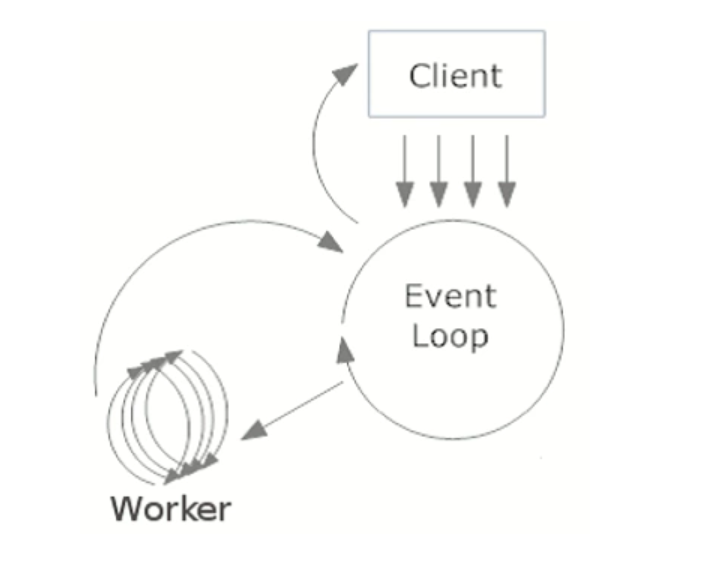

# 偏具体业务和杂项

### 1. 单点登录

* 单点登录，就是在多个系统中，用户只需要登录一次，各个系统即可感知到该用户已经登录
* 场景是分布式情况下，子系统的session不共享的问题。
  * 解决方法有：
    1. session全局同步——影响集群性能
    2. session信息放在redis中——可行
  * 单点登录方法：设立一个专门的登录系统，作为一个子系统。
* 具体方案：
  * SSO系统生成一个token， 并将用户信息存到Redis中，设置过期时间
  * 其他系统请求SSO系统进行登录，得到SSO返回的token，写到Cookie中。
  * 每次请求时，带上cookie，拦截器得的token，判断是否已经登录
* 新问题：cookie是不能跨域的，因为域名不同，cookie带不了，所以会有问题
  * 解决方法：
    * 客户端拿到cookie后，直接对cookie进行解析，取到其中的token，在其他请求的时候都带上这个token，就好了。不用移动要传递cookie
    * 多个域名共享cookie——cookie在写入到客户端时，直接设置cookie的domain，设置成若干个域名。
    * 将token保存在sessionstroage中，其实和方法一一样，不依赖cookie


### 2. CAP

* 评价分布式系统性能的一个理论
  * C: consistency， 数据一致性，分布的各个节点拥有相同版本的数据
  * A：availability,  可用性， 数据具备高可用性
  * P ：partition - tolerance  分区容错性， 容忍网络出现分区，分区之间网络不可达
* 在网络不可靠的前提下，要么CP， 要么AP，既然是分布式系统，作为核心的P是肯定要有的


### 3. BIO、 NIO、AIO

所有语言的I/O都是调用操作系统的接口，这里的BIO、NIO、AIO实质上是java下的概念，区别于select、poll、epoll，那是linux下的概念。

* 内核IO交互：
  1. 网卡收到经过网线传来的网络数据，并将网络数据写到内存（内核？）中。
  2. 当网卡把数据写入到内存（内核）后，网卡向cpu发出一个中断信号，操作系统便能得知有新数据到来，再通过网卡中断程序去处理数据。
  3. 将内存（内核）中的网络数据写入到对应socket的接收缓冲区（用户空间）中。
  4. 当接收缓冲区的数据写好之后，应用程序开始进行数据处理
* 同步 & 异步
  * 同步指的是调用一旦开始，调用者必须等到方法调用返回后，才能继续后续的行为。即方法二一定要等到方法一执行完成后才可以执行。
  * 异步指的是调用立刻返回，调用者不必等待方法内的代码执行结束，就可以继续后续的行为。（具体方法内的代码交由另外的线程执行完成后，可能会进行回调）。即执行方法一的时候，直接交给其他线程执行，不由主线程执行，也就不会阻塞主线程，所以方法二不必等到方法一完成即可开始执行。
  * 同步与异步关注的是方法的执行方是主线程还是其他线程，主线程的话需要等待方法执行完成，其他线程的话无需等待立刻返回方法调用，主线程可以直接执行接下来的代码。
* 阻塞与非阻塞
  * 阻塞与非阻塞指的是单个线程内遇到同步等待时，是否在原地不做任何操作。
  * 阻塞指的是遇到同步等待后，一直在原地等待同步方法处理完成。
  * 非阻塞指的是遇到同步等待，不在原地等待，先去做其他的操作，隔断时间再来观察同步方法是否完成。

* BIO

  BIO全称是Blocking IO，是JDK1.4之前的传统IO模型，本身是**同步阻塞模式**。 线程发起IO请求后，一直阻塞IO，直到缓冲区数据就绪后，再进入下一步操作。针对网络通信都是一请求一应答的方式，虽然简化了上层的应用开发，但在性能和可靠性方面存在着巨大瓶颈，试想一下如果每个请求都需要新建一个线程来专门处理，那么在高并发的场景下，机器资源很快就会被耗尽。

* NIO

  NIO也叫Non-Blocking IO 是**同步非阻塞**的IO模型。线程发起io请求后，立即返回（非阻塞io）。同步指的是必须等待IO缓冲区内的数据就绪，而非阻塞指的是，用户线程不原地等待IO缓冲区，可以先做一些其他操作，但是要定时轮询检查IO缓冲区数据是否就绪。Java中的**NIO 是new IO**的意思。其实是NIO加上IO多路复用技术。普通的NIO是线程轮询查看一个IO缓冲区是否就绪，而Java中的new IO指的是线程轮询地去查看一堆IO缓冲区中哪些就绪，这是一种IO多路复用的思想。IO多路复用模型中，将检查IO数据是否就绪的任务，交给系统级别的select或epoll模型，由系统进行监控，减轻用户线程负担。

  NIO主要有buffer、channel、selector三种技术的整合，通过零拷贝的buffer取得数据，每一个客户端通过channel在selector（多路复用器）上进行注册。服务端不断轮询channel来获取客户端的信息。channel上有connect,accept（阻塞）、read（可读）、write(可写)四种状态标识。根据标识来进行后续操作。所以一个服务端可接收无限多的channel。不需要新开一个线程。大大提升了性能。

  * 缓冲区buffer：

    buffer是一个对象，用来存储临时写入或需要读取的数据，实质上是一个字节数组，具体请款下可以是其他类型的数组

    - ByteBuffer：字节缓冲区
    - CharBuffer:字符缓冲区
    - ShortBuffer：短整型缓冲区
    - IntBuffer：整型缓冲区
    - LongBuffer:长整型缓冲区
    - FloatBuffer：浮点型缓冲区
    - DoubleBuffer：双精度浮点型缓冲区

  * 通道channel

    * Channel是一个通道，可以通过它读取和写入数据，他就像自来水管一样，网络数据通过Channel读取和写入。
    * 通道和流不同之处在于通道是双向的，流只是在一个方向移动，而且通道可以用于读，写或者同时用于读写。也由于全双工特性，比流更好的映射底层操作系统的API
      - FileChannel:是从文件中读取数据。
      - DatagramChannel:从UDP网络中读取或者写入数据。
      - SocketChannel:从TCP网络中读取或者写入数据。
      - ServerSocketChannel:允许你监听来自TCP的连接，就像服务器一样。每一个连接都会有一个SocketChannel产生。
    * 多路复用selector
    * Selector选择器可以监听多个Channel通道感兴趣的事情(read、write、accept(服务端接收)、connect，实现一个线程管理多个Channel，节省线程切换上下文的资源消耗。Selector只能管理非阻塞的通道，FileChannel是阻塞的，无法管理。
    * Selector：选择器对象，通道注册、通道监听对象和Selector相关。
    * SelectorKey：通道监听关键字，通过它来监听通道状态。
    * **监听的事件有**
      - OP_ACCEPT: 接收就绪，serviceSocketChannel使用的
      - OP_READ: 读取就绪，socketChannel使用
      - OP_WRITE: 写入就绪，socketChannel使用
      - OP_CONNECT: 连接就绪，socketChannel使用

  

* AIO

  AIO是真正意义上的异**步非阻塞IO模型**。 上述NIO实现中，需要用户线程定时轮询，去检查IO缓冲区数据是否就绪，占用应用程序线程资源，其实轮询相当于还是阻塞的，并非真正解放当前线程，因为它还是需要去查询哪些IO就绪。而真正的理想的异步非阻塞IO应该让内核系统完成，用户线程只需要告诉内核，当缓冲区就绪后，通知我或者执行我交给你的回调函数。

  AIO可以做到真正的异步的操作，但实现起来比较复杂，支持纯异步IO的操作系统非常少，目前也就windows是IOCP技术实现了，而在Linux上，底层还是是使用的epoll实现的。

  


### 4. 函数回调

* 直观的感觉是函数外包，将本函数应该执行的动作，交给另一个函数执行，可以更加灵活的添加参数。让别人做实际的工作，同时添加一些别的指令。
* 回调函数是你写一个函数，让预先写好的系统来调用。你调用系统的函数，是直调。让系统调用你的函数，就是回调。但假如满足于这种一句话结论，是不会真正明白的。


### 5. 事件驱动

* 事件驱动编程通常只是用一个执行过程，CPU之间不是并发的，在处理多任务的时候，事件驱动编程是使用协作式处理任务，而不是多线程的抢占式。事件驱动简洁易用，只需要注册感兴趣的事件，在回调中设计逻辑就可以了。在调用的过程中，事件循环器（Event Loop）在等待事件的发生，跟着调用处理器。事件处理器不是抢占式的，处理器一般只有很短的生命周期。

* 优势：

  1. 大部分的应用场景中，事件驱动编程优于多线程编程，相对于多线程，事件驱动复杂度较低
  2. 事件驱动经常使用在i?o框架中，可以很好的实现i/O复用。很多高性能的框架I/O都是使用事件驱动：Netty， Mina， Node.js
  3. 易于调试。事件驱动只和事件有关，而不是内部调度。问题容易暴露

* 劣势：

  1. 如果处理器占用时间较长，那会阻塞应用程序的响应。
  2. 无法通过时间来维护本地状态，因为处理器必须返回。
  3. 通常在单CPU环境下，比多线程编程要快，因为没有锁的因素，没有线程切换的损耗。

* 事件循环器： 用于等待和发送消息和事件。linux下是epoll

* 事件循环器不断接受来自客户端（Client）的请求，事件循环器把请求转交给注册了某类事件的工作线程（Worker）处理：

  

根据实现的方式不同，在网络编程中基于事件驱动主要有两种设计模式：Reactor和Proactor。

* Reactor

  * 和普通函数调用的不同之处在于：应用程序不是主动的调用某个API完成处理，而是恰恰相反，应用程序需要提供相应的接口并注册到Reactor上，如果相应的事件发生，Reactor将主动调用应用程序注册的接口，这些接口又称为“回调函数”

  * 有点：

    1）响应快，不必为单个同步时间所阻塞，虽然Reactor本身依然是同步的；

    2）编程相对简单，可以最大程度的避免复杂的多线程及同步问题，并且避免了多线程/进程的切换开销；

    3）可扩展性，可以方便的通过增加Reactor实例个数来充分利用CPU资源；

    4）可复用性，Reactor框架本身与具体事件处理逻辑无关，具有很高的复用性；

、


### 6. Netty

https://juejin.cn/post/6844903704668160008


### 7. 分布式锁

#### 1. 数据库唯一索引

```
获得锁时向表中插入一条记录，释放锁时删除这条记录。唯一索引可以保证该记录只被插入一次，那么就可以用这个记录是否存在来判断是否处于锁定状态。
```

* 这种“锁”没有实效时间，如果解锁失败的话，其他进程也无法获得锁（唯一值只能插入一次，多次插入报错）
* 只能是非重入锁，原因同上
* 只能是非阻塞锁，因为插入失败直接报错的，不能走阻塞

#### 2. Redis的SETNX指令：

```
使用 SETNX（set if not exist）指令插入一个键值对，如果 Key 已经存在，那么会返回 False，否则插入成功并返回 True。

SETNX 指令和数据库的唯一索引类似，保证了只存在一个 Key 的键值对，那么可以用一个 Key 的键值对是否存在来判断是否存于锁定状态。

EXPIRE 指令可以为一个键值对设置一个过期时间，从而避免了数据库唯一索引实现方式中释放锁失败的问题。(不同于数据库唯一索引的地方)
```

#### 3. Redis的RedLock算法

```
使用了多个 Redis 实例来实现分布式锁，这是为了保证在发生单点故障时仍然可用。

尝试从 N 个互相独立 Redis 实例获取锁；
计算获取锁消耗的时间，只有时间小于锁的过期时间，并且从大多数（N / 2 + 1）实例上获取了锁，才认为获取锁成功；
如果获取锁失败，就到每个实例上释放锁
```

#### 4. Zookeeper的有序节点

1. Zookeeper 提供了一种树形结构的命名空间，/app1/p_1 节点的父节点为 /app1。

2. 节点类型：

   ```
   永久节点：不会因为会话结束或者超时而消失；
   临时节点：如果会话结束或者超时就会消失；
   有序节点：会在节点名的后面加一个数字后缀，并且是有序的，例如生成的有序节点为 /lock/node-0000000000，它的下一个有序节点则为 /lock/node-0000000001，以此类推
   ```

3. 监听器：

   为一个节点注册监听器，在节点状态发生改变时，会给客户端发送消息。

4. 分布式锁实现“

   - 创建一个锁目录 /lock；
   - 当一个客户端需要获取锁时，在 /lock 下创建临时的且有序的子节点；
   - 客户端获取 /lock 下的子节点列表，判断自己创建的子节点是否为当前子节点列表中序号最小的子节点，如果是则认为获得锁；否则监听自己的前一个子节点，获得子节点的变更通知后重复此步骤直至获得锁；
   - 执行业务代码，完成后，删除对应的子节点。

5. 会话超时：

   如果一个已经获得锁的会话超时了，因为创建的是临时节点，所以该会话对应的临时节点会被删除，其它会话就可以获得锁了。可以看到，这种实现方式不会出现数据库的唯一索引实现方式释放锁失败的问题。

6. 羊群效应：

   一个节点未获得锁，只需要监听自己的前一个子节点，这是因为如果监听所有的子节点，那么任意一个子节点状态改变，其它所有子节点都会收到通知（羊群效应，一只羊动起来，其它羊也会一哄而上），而我们只希望它的后一个子节点收到通知。


### 8. 系统设计

#### 知乎：

https://www.zhihu.com/question/26312148

4S 法：

* Scenario 场景
  * 哪些功能
  * 多大访问
  * 并发用户
  * 读频率
  * 写频率
  * 核心功能
* Service 服务
  * 功能拆分成更小的服务
    * 注册，推送、上传文件、关注……
* Storage 存储
  * 根据服务的数据特性选择合适存贮
  * 数据库
    * SQL
    * NoSQL
  * 文件系统
  * 缓存系统
  * 细化数据表结构
* Scale 扩展
  * 优化：
    * 解决设计缺陷
    * 新功能
    * 特殊情况处理
  * 维护：
    * 系统的鲁棒性和扩展性
    * 流量暴增

#### 常见优化措施

Cache：缓存，万金油，哪里不行优先考虑

Queue：消息队列，常见使用Linkedin的kafka

Asynchronized：批处理＋异步，减少系统IO瓶颈

Load Balance: 负载均衡，可以使用一致性hash技术做到尽量少的数据迁移

Parallelization：并行计算，比如MapReduce

Replication：提高可靠性，如HDFS，基于位置感知的多块拷贝

Partition：数据库sharding，通过hash取摸

#### 1. 考察目的

```
思维是否开阔、灵活
知识广度
知识深度
架构能力是否足够，是否能设计出可扩展的系统
是否能熟练使用常见工具并且知晓特性，能够因地制宜选择合适的方案和工具
```

#### 2. 明确问题或者需求

1. 请求量
2. 请求峰值 --> 是高并发 --> 可能会用到缓存
3. 通讯过程是否需要永久保存 --> 磁盘大小
4. 是读多还是写多

#### 3. 一些常见的性能指标

- Nginx：能轻松的处理c100k问题，内存越大，能处理的并发量越高
- Redis: https://redis.io/topics/benchmarks 表明，对于GET/SET来说，QPS 10-100k没啥大问题
- MySQL: https://www.mysql.com/why-mysql/benchmarks/ 表明，对于只读，QPS 几百k没啥问题，对于写，MySQL 5.7 QPS 100k 几乎是上限
- PG: https://www.percona.com/blog/2017/01/06/millions-queries-per-second-postgresql-and-mysql-peaceful-battle-at-modern-demanding-workloads/ 也是差不多

#### 4. 常见知识

- 最简单粗暴也是实践中最常用的应对方案就是：升级机器、加机器(所以架构的时候要考虑好水平扩展)
- 大多数应用都是读大于写，解决方案很简单：加缓存+读写分离
- 对于写大于读的方案，见 [(关系型)数据库优化总结](https://jiajunhuang.com/articles/2018_01_08-db_optimizations.md.html)
- Nginx：能轻松的处理c100k问题，内存越大，能处理的并发量越高
- Redis: https://redis.io/topics/benchmarks 表明，对于GET/SET来说，QPS 10-100k没啥大问题
- MySQL: https://www.mysql.com/why-mysql/benchmarks/ 表明，对于只读，QPS 几百k没啥问题，对于写，MySQL 5.7 QPS 100k 几乎是上限
- PG: https://www.percona.com/blog/2017/01/06/millions-queries-per-second-postgresql-and-mysql-peaceful-battle-at-modern-demanding-workloads/ 也是差不多
- B, M, G, T, PB之间的关系换算要清楚
- 需要长时间处理的任务或者是强依赖网络(而网络不确定性大的问题)，妥妥的用队列，例如消息推送
- 性能优化套路：加机器 - 加缓存 - 优化数据库索引 - 垂直拆数据库表 - 水平拆数据库表 - 垂直分库 - 水平分库


### 9. RPC

```
RPC 是 Remote Procedure Call 的缩写，即，远程过程调用。RPC 是一个计算机通信协议。该协议允许运行于一台计算机的程序调用另一台计算机的子程序，而开发人员无需额外地为这个交互编程。
```

```
 Dubbo 提供的是基于接口的远程方法调用，即客户端只需要知道接口的定义即可调用远程服务。
```

```
在 Java 中接口并不能直接调用实例方法，必须通过其实现类对象来完成此操作，这意味着客户端必须为这些接口生成代理对象，对此 Java 提供了 Proxy、InvocationHandler 生成动态代理的支持；生成了代理对象，那么每个具体的发方法是怎么调用的呢？jdk 动态代理生成的代理对象调用指定方法时实际会执行 InvocationHandler 中定义的 #invoke 方法，在该方法中完成远程方法调用并获取结果。
```

* 注册中心与服务发现

  ```
  实际上现在大多系统都是集群部署的，多台主机/容器对外提供相同的服务，如果集群的节点数量很大的话，那么管理服务地址也将是一件十分繁琐的事情，常见的做法是各个服务节点将自己的地址和提供的服务列表注册到一个 注册中心，由 注册中心 来统一管理服务列表；这样的做法解决了一些问题同时为客户端增加了一项新的工作——那就是服务发现，通俗来说就是从注册中心中找到远程方法对应的服务列表并通过某种策略从中选取一个服务地址来完成网络通信。
  ```

* 服务端

  ```
  服务端最重要的任务便是提供服务接口的真正实现并在某个端口上监听网络请求，监听到请求后从网络请求中获取到对应的参数（比如服务接口、方法、请求参数等），再根据这些参数通过反射的方式调用接口的真正实现获取结果并将其写入对应的响应流中。
  
  加载服务接口，并缓存
  服务注册，将服务接口以及服务主机信息写入注册中心（本例使用的是 zookeeper)
  启动网络服务器并监听
  反射，本地调用
  ```

* 客户端

  ```
  代理服务接口生成代理对象
  服务发现（连接 zookeeper，拿到服务地址列表，通过客户端负载策略获取合适的服务地址）
  远程方法调用（本例通过 Netty，发送消息，并获取响应结果）
  ```

### 10. 动态代理

https://segmentfault.com/a/1190000011291179

* 静态代理与动态代理的区别主要在：

  ```
  静态代理在编译时就已经实现，编译完成后代理类是一个实际的class文件
  动态代理是在运行时动态生成的，即编译完成后没有实际的class文件，而是在运行时动态生成类字节码，并加载到JVM中
  ```

* 特点：

  ```
  动态代理对象不需要实现接口，但是要求目标对象必须实现接口，否则不能使用动态代理。
  ```

* JDK动态代理中生成的类：

  - [java.lang.reflect Proxy](http://tool.oschina.net/uploads/apidocs/jdk-zh/java/lang/reflect/Proxy.html)，主要方法为

  ```java
  static Object    newProxyInstance(ClassLoader loader,  //指定当前目标对象使用类加载器
  
   Class<?>[] interfaces,    //目标对象实现的接口的类型
   InvocationHandler h      //事件处理器
  ) 
  //返回一个指定接口的代理类实例，该接口可以将方法调用指派到指定的调用处理程序。
  ```

  - [java.lang.reflect InvocationHandler](http://tool.oschina.net/uploads/apidocs/jdk-zh/java/lang/reflect/InvocationHandler.html)，主要方法为

  ```java
   Object    invoke(Object proxy, Method method, Object[] args) 
  // 在代理实例上处理方法调用并返回结果。
  ```

  > 举例：保存用户功能的动态代理实现

  - 接口类： IUserDao

  ```java
  package com.proxy;
  
  public interface IUserDao {
      public void save();
  }
  ```

  - 目标对象：UserDao

  ```java
  package com.proxy;
  
  public class UserDao implements IUserDao{
  
      @Override
      public void save() {
          System.out.println("保存数据");
      }
  }
  ```

  - 动态代理对象：UserProxyFactory

  ```java
  package com.proxy;
  
  import java.lang.reflect.InvocationHandler;
  import java.lang.reflect.Method;
  import java.lang.reflect.Proxy;
  
  public class ProxyFactory {
  
      private Object target;// 维护一个目标对象
  
      public ProxyFactory(Object target) {
          this.target = target;
      }
  
      // 为目标对象生成代理对象
      public Object getProxyInstance() {
          return Proxy.newProxyInstance(target.getClass().getClassLoader(),  target.getClass().getInterfaces(),//指定了类加载器， 和目标对象实现的接口类型
                  new InvocationHandler() { // 实现事件处理器
  
                      @Override  // 重写invoke，实现方法调用并发挥结果
                      public Object invoke(Object proxy, Method method, Object[] args) throws Throwable {
                          System.out.println("开启事务");
  
                          // 执行目标对象方法
                          Object returnValue = method.invoke(target, args);
  
                          System.out.println("提交事务");
                          return null;
                      }
                  });
      }
  }
  ```

  - 测试类：TestProxy

  ```java
  package com.proxy;
  
  import org.junit.Test;
  
  public class TestProxy {
  
      @Test
      public void testDynamicProxy (){
          IUserDao target = new UserDao();
          System.out.println(target.getClass());  //输出目标对象信息
          IUserDao proxy = (IUserDao) new ProxyFactory(target).getProxyInstance();
          System.out.println(proxy.getClass());  //输出代理对象信息
          proxy.save();  //执行代理方法
      }
  }
  ```

  - 输出结果

  ```
  class com.proxy.UserDao
  class com.sun.proxy.$Proxy4
  开启事务
  保存数据
  提交事务
  ```

* cglib

  ```
  cglib (Code Generation Library )是一个第三方代码生成类库，运行时在内存中动态生成一个子类对象从而实现对目标对象功能的扩展。
  ```

  * 特点：
    - JDK的动态代理有一个限制，就是使用动态代理的对象必须实现一个或多个接口。
      如果想代理没有实现接口的类，就可以使用CGLIB实现。
    - CGLIB是一个强大的高性能的代码生成包，它可以在运行期扩展Java类与实现Java接口。
      它广泛的被许多AOP的框架使用，例如Spring AOP和dynaop，为他们提供方法的interception（拦截）。
    - CGLIB包的底层是通过使用一个小而快的字节码处理框架ASM，来转换字节码并生成新的类。
      不鼓励直接使用ASM，因为它需要你对JVM内部结构包括class文件的格式和指令集都很熟悉。
  * 和动态代理的最大区别：
    - 使用动态代理的对象必须实现一个或多个接口
    - 使用cglib代理的对象则无需实现接口，达到代理类无侵入。

  > 举例：保存用户功能的动态代理实现

  - 目标对象：UserDao

  ```java
  package com.cglib;
  
  public class UserDao{
  
      public void save() {
          System.out.println("保存数据");
      }
  }
  ```

  - 代理对象：ProxyFactory

  ```java
  package com.cglib;
  
  import java.lang.reflect.Method;
  
  import net.sf.cglib.proxy.Enhancer;
  import net.sf.cglib.proxy.MethodInterceptor;
  import net.sf.cglib.proxy.MethodProxy;
  
  public class ProxyFactory implements MethodInterceptor{
  
      private Object target;//维护一个目标对象
      public ProxyFactory(Object target) {
          this.target = target;
      }
      
      //为目标对象生成代理对象
      public Object getProxyInstance() {
          //工具类
          Enhancer en = new Enhancer();
          //设置父类
          en.setSuperclass(target.getClass());
          //设置回调函数
          en.setCallback(this);
          //创建子类对象代理
          return en.create();
      }
  
      @Override
      public Object intercept(Object obj, Method method, Object[] args, MethodProxy proxy) throws Throwable {
          System.out.println("开启事务");
          // 执行目标对象的方法
          Object returnValue = method.invoke(target, args);
          System.out.println("关闭事务");
          return null;
      }
  }
  ```

  - 测试类：TestProxy

  ```java
  package com.cglib;
  
  import org.junit.Test;
  
  public class TestProxy {
  
      @Test
      public void testCglibProxy(){
          //目标对象
          UserDao target = new UserDao();
          System.out.println(target.getClass());
          //代理对象
          UserDao proxy = (UserDao) new ProxyFactory(target).getProxyInstance();
          System.out.println(proxy.getClass());
          //执行代理对象方法
          proxy.save();
      }
  }
  ```

  - 输出结果

  ```
  class com.cglib.UserDao
  class com.cglib.UserDao$$EnhancerByCGLIB$$552188b6
  开启事务
  保存数据
  关闭事务
  ```


##### 总结

1. 静态代理实现较简单，只要代理对象对目标对象进行包装，即可实现增强功能，但静态代理只能为一个目标对象服务，如果目标对象过多，则会产生很多代理类。
2. JDK动态代理需要目标对象实现业务接口，代理类只需实现InvocationHandler接口。
3. 动态代理生成的类为 class com.sun.proxy.\\$Proxy4，cglib代理生成的类为class.com.cglib.UserDao$$EnhancerByCGLIB$$552188b6。
4. 静态代理在编译时产生class字节码文件，可以直接使用，效率高。
5. 动态代理必须实现InvocationHandler接口，通过反射代理方法，比较消耗系统性能，但可以减少代理类的数量，使用更灵活。
6. cglib代理无需实现接口，通过生成类字节码实现代理，比反射稍快，不存在性能问题，但cglib会继承目标对象，需要重写方法，所以目标对象不能为final类。